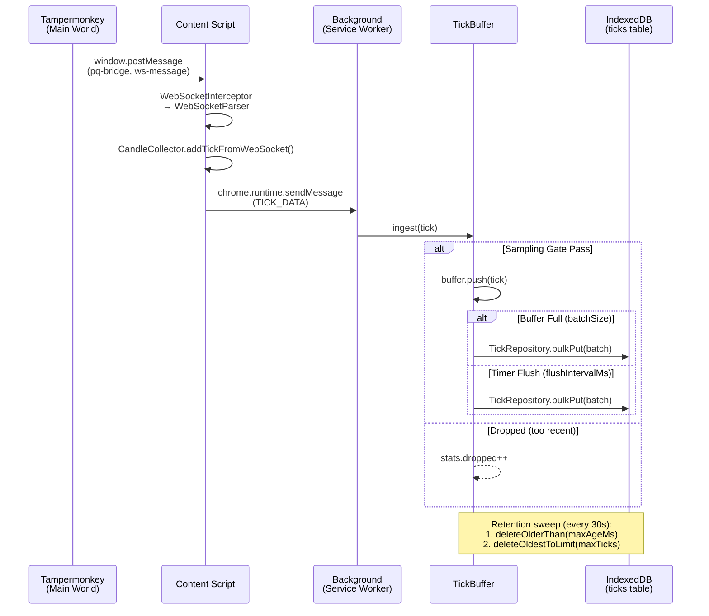
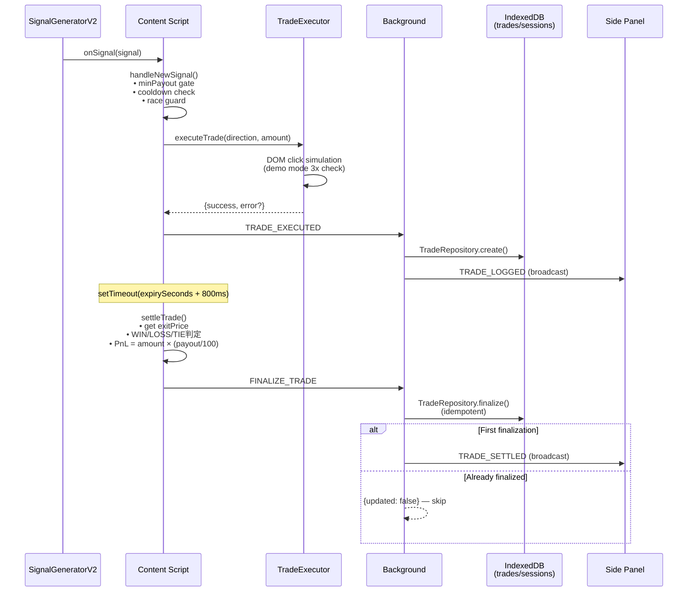
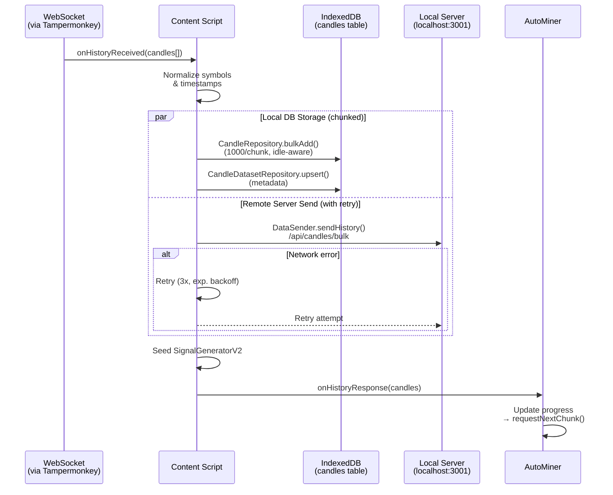

# Data Flow Architecture

> Mermaid diagrams for the three primary data flows in the extension.

---

## 1. Tick Flow (Real-time Price → DB)



---

## 2. Trade Flow (Signal → Execution → Settlement)



---

## 3. Storage Flow (History Candles → IndexedDB + Server)



---

## 4. TickBuffer / Candle Statistics (Observability)

```mermaid
flowchart LR
    SP[Side Panel<br/>DBMonitorDashboard] -->|GET_TICK_BUFFER_STATS| BG[Background]
    BG -->|tickBuffer.getStats()| TB[TickBuffer]
    BG -->|TickRepository.getStats()| DB[(IndexedDB)]
    BG -->|Response| SP

    SP -->|FLUSH_TICK_BUFFER| BG
    SP -->|RUN_TICK_RETENTION| BG

    SP -->|GET_DB_MONITOR_STATUS| CS[Content Script]
    CS -->|DataSender.getStats()| DS[DataSender]
    CS -->|Response| SP

    SP -->|Direct Dexie access| DB
    SP -->|fetch /health| SRV[localhost:3001]
```
