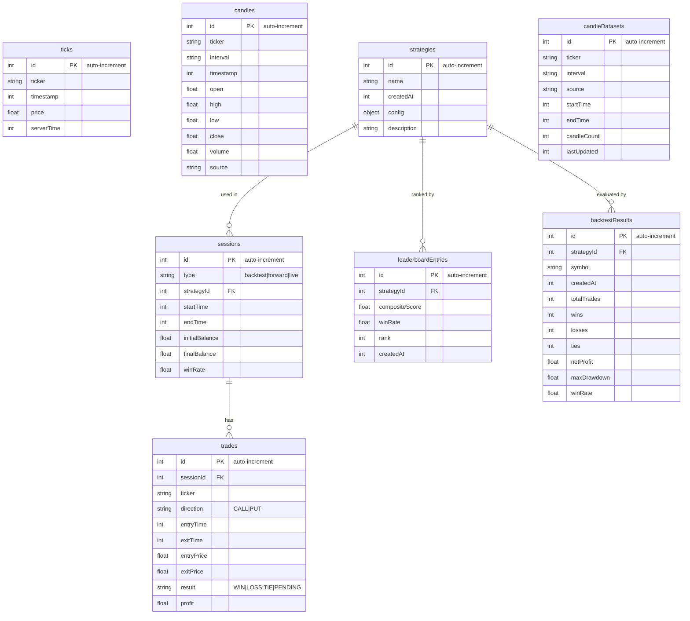

# Local Database 아키텍처 — IndexedDB (Dexie.js)

> **범위**: 브라우저 내 IndexedDB. 외부 수집 서버(SQLite)는 [`../local-collector/`](../local-collector/README.md) 참조.

## 역할

| 구분 | 설명 |
|------|------|
| **목적** | 실시간 트레이딩 세션에 필요한 데이터를 브라우저 내부에 영구 저장 |
| **기술** | IndexedDB — [Dexie.js](https://dexie.org/) v4 래퍼 |
| **소스** | `src/lib/db/index.ts` |
| **접근 주체** | Background Worker, Content Script, Side Panel (모두 같은 Origin) |

```
┌──────────────────────────────────────────┐
│         Chrome Extension (Origin)         │
│                                           │
│  Background ──┐                           │
│  Content   ───┼──▶ IndexedDB (Dexie.js)  │
│  Side Panel ──┘        │                  │
│                        ▼                  │
│              8 Tables, v6 Schema          │
└──────────────────────────────────────────┘
```

## 저장 대상 — "무엇을 저장하는가?"

| 데이터 | IndexedDB | Local Collector (SQLite) |
|--------|:---------:|:------------------------:|
| 실시간 Tick (DOM/WS) | ✅ | ✅ (DataSender 경유) |
| OHLCV 캔들 | ✅ (최근 버퍼) | ✅ (전량 보관) |
| 전략 설정 | ✅ | — |
| 거래 세션 | ✅ | — |
| 개별 거래 기록 | ✅ | — |
| 백테스트 결과 | ✅ | — |
| 리더보드 | ✅ | — |
| 리샘플된 1분봉 캐시 | — | ✅ |

> **핵심 차이**: IndexedDB는 *트레이딩 상태*(전략, 거래, 세션)를 소유하고, Local Collector는 *시장 데이터 아카이브*(틱, 캔들 전량)를 소유한다.

## DB 스키마 (v6)



### 버전 히스토리

| 버전 | 변경 내용 |
|------|-----------|
| v1 | ticks, strategies, sessions, trades |
| v2 | + candles (OHLCV) |
| v3 | + leaderboardEntries |
| v4 | + backtestResults, candleDatasets, candles.source 필드 |
| v5 | 중복 캔들 제거 마이그레이션 |
| v6 | `[ticker+interval+timestamp]` 유니크 인덱스 적용 |

### 주요 인덱스

| 테이블 | 인덱스 | 용도 |
|--------|--------|------|
| ticks | `[ticker+timestamp]` | 시간 범위 조회 |
| candles | `[ticker+interval+timestamp]` (unique) | 중복 방지 + 범위 조회 |
| trades | `sessionId`, `ticker`, `entryTime` | 세션별/자산별 거래 검색 |
| leaderboardEntries | `compositeScore`, `winRate` | 순위 정렬 |

## Repository 패턴

각 테이블은 `XxxRepository` 객체로 CRUD를 노출한다.

| Repository | 핵심 메서드 |
|-----------|-------------|
| **TickRepository** | `add()`, `bulkAdd()`, `getByTicker()`, `getByTimeRange()`, `deleteOlderThan()` |
| **CandleRepository** | `add()`, `bulkAdd()` (배치 중복 제거), `getByTicker()`, `getRecent()`, `export()`, `import()` |
| **TradeRepository** | `create()`, `finalize()` (idempotent), `getBySession()`, `getPending()` |
| **SessionRepository** | `create()`, `update()`, `finalize()`, `getByType()` |
| **LeaderboardRepository** | `saveResults()`, `getTop()`, `getByStrategy()` |
| **BacktestResultRepository** | `save()`, `getByStrategy()`, `getBySymbol()` |
| **CandleDatasetRepository** | `upsert()`, `getByTicker()` |

## 보관(Retention) 정책

| 데이터 | 정책 | 메커니즘 |
|--------|------|----------|
| **Ticks** | 7일 후 자동 삭제 | `chrome.alarms` (Background) → `TickRepository.deleteOlderThan()` |
| **Candles** | 무기한 (디스크 허용 범위) | 유니크 인덱스로 중복 방지, 수동 삭제 가능 |
| **Trades / Sessions** | 무기한 | — |
| **Backtest Results** | 무기한 | `clear()` 수동 호출 |

> **용량 참고**: IndexedDB 한도는 브라우저/디스크에 따라 다름. Chrome은 디스크의 ~80%까지 사용 가능하나, 대용량 히스토리 데이터는 Local Collector(SQLite)에 보관하는 것이 권장됨.

## 제약사항

- IndexedDB는 **동기 API가 없다** — 모든 작업이 async/Promise 기반.
- Dexie v4의 `liveQuery`를 사용하면 반응형 구독이 가능하나, 현재 직접 사용하지 않음.
- Service Worker 비활성화 시 주기적 정리 알람이 실행되지 않을 수 있음.
- 브라우저 간 데이터 이동 불가 — export/import JSON으로 대응.

## 관련 문서

- **Local Collector (SQLite)**: [`../local-collector/README.md`](../local-collector/README.md)
- **데이터 흐름 전체도**: [`../../head/map.md`](../../head/map.md) → "데이터 저장소" 섹션
- **소스 코드**: `src/lib/db/index.ts`
