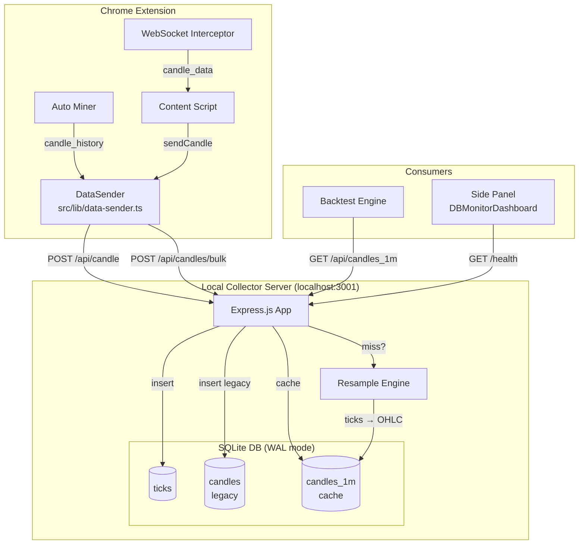
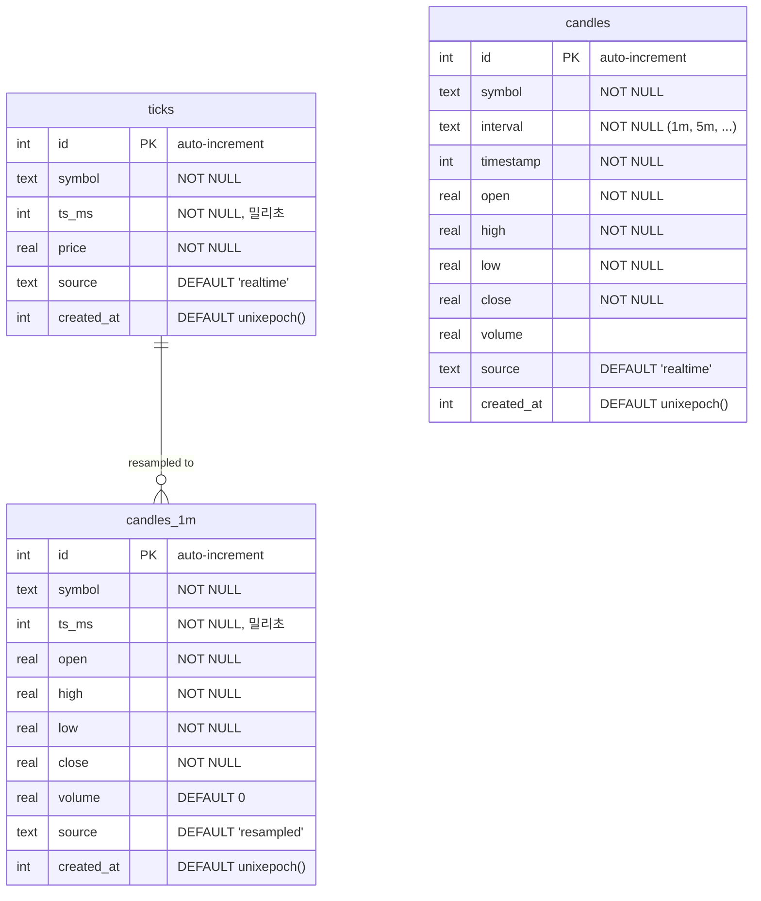

# Local Collector 아키텍처 — Express + SQLite

> **범위**: 로컬 수집 서버 (`localhost:3001`). 브라우저 내 IndexedDB는 [`../local-database/`](../local-database/README.md) 참조.

## 역할

| 구분 | 설명 |
|------|------|
| **목적** | 대용량 시장 데이터(틱, 캔들)를 디스크에 영구 보관하고, 백테스트용 리샘플 캔들을 제공 |
| **기술** | Express.js v5 + better-sqlite3 (WAL 모드) |
| **소스** | `scripts/data-collector-server.ts` |
| **실행** | `npm run collector` (개발 시 수동 실행) |
| **DB 파일** | `data/market-data.db` (프로젝트 루트 기준) |
| **클라이언트** | Content Script → `src/lib/data-sender.ts` (HTTP fetch) |

## 전체 구조도



## 왜 SQLite가 별도로 필요한가?

| 문제 | IndexedDB만으로는 |
|------|-------------------|
| **대용량 히스토리** | 수십만 틱/캔들이 브라우저 스토리지에 계속 쌓이면 성능 저하 + 쿼터 위험 |
| **리샘플링** | SQL 집계(GROUP BY + OHLC)가 JS 루프보다 수십 배 빠름 |
| **백테스트 재사용** | 한 번 수집하면 익스텐션 재설치/브라우저 변경 후에도 데이터 유지 |
| **디버깅** | `sqlite3 data/market-data.db` CLI로 즉시 쿼리 가능 |
| **서버 꺼져도 안전** | 익스텐션은 IndexedDB에 기본 저장, DataSender는 실패 시 graceful degrade |

## SQLite 스키마



### 유니크 인덱스

| 테이블 | 유니크 인덱스 | 용도 |
|--------|--------------|------|
| **ticks** | `(symbol, ts_ms, source)` | 동일 소스의 동일 시점 중복 방지 |
| **candles** | `(symbol, interval, timestamp)` | 레거시 캔들 중복 방지 |
| **candles_1m** | `(symbol, ts_ms, source)` | 리샘플 결과 중복 방지 |

### SQLite Pragma 설정

```sql
PRAGMA journal_mode = WAL;          -- 읽기/쓰기 동시성 향상
PRAGMA synchronous = NORMAL;        -- 성능/안전 균형
PRAGMA cache_size = -1000000;       -- 1GB 메모리 캐시
PRAGMA busy_timeout = 5000;         -- 잠금 대기 5초
```

## API 엔드포인트

### 데이터 수집 (Ingestion)

| 메서드 | 경로 | 용도 | 요청 본문 |
|--------|------|------|-----------|
| `POST` | `/api/tick` | 단일 틱 저장 | `{ symbol, timestamp, price, source? }` |
| `POST` | `/api/ticks/bulk` | 벌크 틱 저장 | `{ ticks: [...] }` |
| `POST` | `/api/candle` | 단일 캔들 저장 (+ ticks 이중 저장) | `{ symbol, interval, timestamp, open, high, low, close, volume?, source? }` |
| `POST` | `/api/candles/bulk` | 벌크 캔들 저장 (+ ticks 이중 저장) | `{ candles: [...] }` |

> **이중 저장**: candle POST 시 payout 데이터가 아니면 `close` 값을 tick으로도 저장하여 리샘플 소스 확보.

### 데이터 조회 (Query)

| 메서드 | 경로 | 용도 | 주요 파라미터 |
|--------|------|------|--------------|
| `GET` | `/api/ticks` | 틱 조회 | `symbol`, `start`, `end`, `source`, `limit` |
| `GET` | `/api/candles` | 레거시 캔들 조회 | `symbol`, `interval`, `start`, `end`, `limit` |
| `GET` | `/api/candles_1m` | **1분봉 캐시 조회** (미스 시 자동 리샘플) | `symbol`, `start`, `end`, `force_resample` |
| `GET` | `/api/candles/resampled` | 레거시 리샘플 엔드포인트 | `symbol`, `interval`, `start`, `end` |

### 통계 / 진단

| 메서드 | 경로 | 용도 |
|--------|------|------|
| `GET` | `/health` | 서버 상태 + 총 레코드 수 |
| `GET` | `/api/ticks/stats` | 심볼별 틱 통계 (소스별 구분) |
| `GET` | `/api/candles/stats` | 심볼별 캔들 통계 |
| `GET` | `/api/candles_1m/stats` | 1분봉 캐시 통계 |
| `GET` | `/api/candles/stats/detailed` | 종합 데이터 품질 리포트 |

### 유지보수

| 메서드 | 경로 | 용도 |
|--------|------|------|
| `POST` | `/api/migrate/candles-to-ticks` | 레거시 candles → ticks 마이그레이션 |
| `POST` | `/api/candles_1m/resample` | 수동 1분봉 리샘플 트리거 |

## 리샘플 엔진

```
ticks 테이블  ──▶  60초 버킷 그룹화  ──▶  OHLC 계산  ──▶  candles_1m 캐시
   │                                                         │
   │  ts_ms 기준 정렬                                        │  source = 'resampled'
   │  WHERE symbol = ? AND ts_ms BETWEEN ? AND ?             │  증분 업데이트 (마지막 캐시 이후)
```

**리샘플 규칙**:
1. 틱을 `ts_ms / 60000` 기준으로 60초 버킷에 할당
2. 버킷 내 첫 번째 가격 = `open`, 마지막 = `close`, 최소 = `low`, 최대 = `high`
3. 결과를 `candles_1m`에 `INSERT OR REPLACE`
4. 증분 처리: 마지막 캐시 `ts_ms` 이후 틱만 리샘플 (효율적)
5. `force_resample=true` 시 전체 재계산

**Payout 필터링**:
- `open === high === low === close` 이고 값이 [0, 100] 범위 → payout 데이터로 판단, ticks 저장에서 제외
- 이 필터가 없으면 기술적 지표 계산이 오염됨

## 데이터 흐름 시나리오

### 시나리오 A: 실시간 캔들 수집

```
WebSocket → Content Script → DataSender.sendCandle()
                                  │
                                  ▼
                        POST /api/candle
                                  │
                           ┌──────┴──────┐
                           ▼             ▼
                    candles 테이블   ticks 테이블
                    (레거시)        (close → price)
```

### 시나리오 B: Auto Miner 히스토리 수집

```
Auto Miner → WebSocket으로 candle_history 요청
                  │
                  ▼
    DataSender.sendHistory(candles[])
                  │
                  ▼
        POST /api/candles/bulk
                  │
          단일 트랜잭션으로 배치 저장
                  │
           ┌──────┴──────┐
           ▼             ▼
    candles 테이블   ticks 테이블
```

### 시나리오 C: 백테스트 데이터 조회

```
Backtest Engine → GET /api/candles_1m?symbol=EUR/USD
                         │
                    candles_1m 캐시 확인
                         │
                   ┌─────┴─────┐
                   │ HIT       │ MISS
                   ▼           ▼
             캐시 반환    resampleAndCache()
                              │
                         ticks 로드
                              │
                         OHLC 계산
                              │
                         candles_1m 저장
                              │
                         결과 반환
```

## 보관(Retention) 정책

| 테이블 | 정책 | 비고 |
|--------|------|------|
| **ticks** | 무기한 (디스크 허용 범위) | 리샘플 소스이므로 삭제 시 주의 |
| **candles** | 무기한 (레거시 호환) | 신규 데이터는 ticks 기반으로 전환 중 |
| **candles_1m** | 무기한 (캐시) | `POST /api/candles_1m/resample`로 재생성 가능 |

> **디스크 관리**: `data/market-data.db` 파일 크기를 주기적으로 모니터. 수십만 틱 기준 수백 MB 예상. 필요 시 오래된 심볼의 ticks를 수동 삭제 가능.

## 제약사항

- 서버가 **로컬에서만 실행** — 원격 접근 불가 (CORS는 로컬 개발용)
- Express body-parser 한도 **50MB** — 극대용량 벌크는 분할 전송 필요
- SQLite **단일 쓰기** — 동시 벌크 요청 시 `busy_timeout` 내 직렬화
- 서버 중단 시 DataSender는 에러를 무시하고 계속 동작 (graceful degrade)
- `npm run collector` 수동 실행 필요 (자동 시작 메커니즘 없음)

## 개발 환경 설정

```bash
# 수집 서버 시작
npm run collector

# 서버 상태 확인
curl http://localhost:3001/health

# 심볼별 틱 통계
curl http://localhost:3001/api/ticks/stats

# 1분봉 조회 (자동 리샘플)
curl "http://localhost:3001/api/candles_1m?symbol=EUR/USD"

# SQLite CLI 직접 접근
sqlite3 data/market-data.db ".tables"
sqlite3 data/market-data.db "SELECT symbol, COUNT(*) FROM ticks GROUP BY symbol;"
```

## 관련 문서

- **IndexedDB (Dexie.js)**: [`../local-database/README.md`](../local-database/README.md)
- **DataSender 클라이언트**: `src/lib/data-sender.ts`
- **수집 서버 소스**: `scripts/data-collector-server.ts`
- **데이터 흐름 전체도**: [`../../head/map.md`](../../head/map.md) → "데이터 저장소" 섹션
- **Tick/Candle 분리 상세**: `docs/features/tick-candle-separation/`
