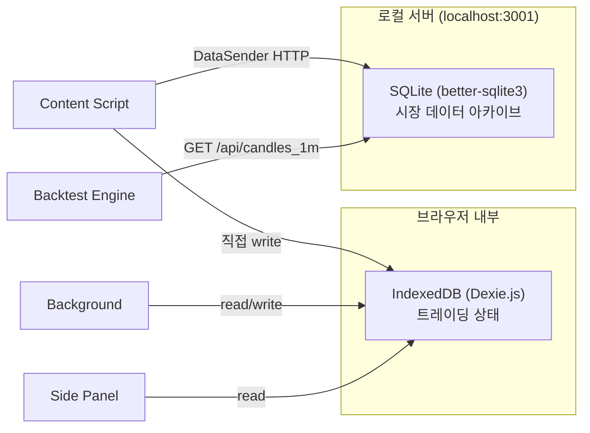

# Architecture ↔ Feature 매핑

아키텍처 관점과 기능 관점의 작업을 서로 참조할 수 있도록 매핑합니다.

---

## Content Script (`src/content-script/`)

> Pocket Option 페이지에 주입되어 DOM 조작과 WebSocket 인터셉트를 수행하는 모듈.
> 가격 데이터 수집, 거래 버튼 클릭, 자산 전환, 인디케이터 값 읽기 등 모든 "페이지 내 동작"을 담당.

- **핵심 하위 모듈**:
  - `data-collector.ts` — MutationObserver 기반 DOM 가격 캡처 → Tick 생성
  - `executor.ts` — CALL/PUT 버튼 클릭 시뮬레이션, 데모 모드 3중 체크 (⚠️ 안전 최우선)
  - `candle-collector.ts` — DOM에서 OHLCV 캔들 데이터 수집, 틱→캔들 변환
  - `payout-monitor.ts` — 자산 목록 DOM 파싱, 페이아웃 비율 추적, 고페이아웃 자산 필터링/전환
  - `indicator-reader.ts` — 페이지에 표시된 RSI/Stochastic/MACD/BB 값 DOM에서 직접 읽기
  - `websocket-interceptor.ts` — Tampermonkey 브릿지 경유 WebSocket 메시지 가로채기, 직접 메시지 전송
  - `websocket-parser.ts` — WebSocket 원시 메시지 → price_update/candle_data/candle_history 타입 분류
  - `auto-miner.ts` — 고페이아웃 자산 자동 순회, WebSocket으로 히스토리 요청 → DataSender로 로컬 서버 전송
  - `selector-resolver.ts` — 다단계 DOM 셀렉터 폴백 시스템 (primary → fallback, 캐싱)
- 관련 기능
  - `docs/features/data-collector/`
  - `docs/features/navigator/`
  - `docs/features/executor/`
- 세부 작업
  - `docs/architecture/content-script/data-capture/`
  - `docs/architecture/content-script/dom-selectors/`
  - `docs/architecture/content-script/ui-simulation/`

---

## Background Service Worker (`src/background/`)

> Chrome Extension의 Service Worker로서 중앙 메시지 라우터 역할.
> Content Script/Side Panel 간 메시지 중계, 거래 상태 관리, DB 저장, 에러 감지 시 텔레그램 알림 전송.

- **핵심 동작**:
  - 메시지 핸들링: TICK_DATA(저장), TRADE_EXECUTED(기록), GET_STATUS, START/STOP_TRADING
  - 에러 핸들러 구독 — `ErrorSeverity.ERROR` 이상일 때 텔레그램 자동 알림
  - `chrome.alarms`로 주기적 데이터 정리 (7일 이상 오래된 Tick 삭제)
  - Side Panel 설정 (`sidePanel.setPanelBehavior`)
- 관련 기능
  - `docs/features/executor/`
  - `docs/features/backtester-logger/`
- 세부 작업
  - `docs/architecture/background-service-worker/auto-trading-loop/`
  - `docs/architecture/background-service-worker/tab-state/`
  - `docs/architecture/background-service-worker/scheduling/`

---

## Side Panel UI (`src/side-panel/`)

> React + Tailwind CSS 기반 사용자 인터페이스. 6개 탭으로 구성된 대시보드.
> Background와 메시지 통신하여 상태 조회/제어를 수행.

- **핵심 컴포넌트**:
  - `SignalPanel.tsx` — 실시간 매매 신호 표시
  - `AutoTradePanel.tsx` — 자동매매 설정 및 제어 (시작/중지, 리스크 파라미터)
  - `Dashboard.tsx` / `StatusCard.tsx` — 거래 상태, 잔액, 승률 표시
  - `AutoMinerControl.tsx` — 자동 데이터 채굴 제어
  - `HistoryMiner.tsx` — 히스토리 데이터 채굴 UI
  - `Leaderboard.tsx` — 전략별 백테스트 순위표
  - `SettingsPanel.tsx` — 텔레그램 봇 설정 등
  - `LogViewer.tsx` — 실시간 로그 표시
  - `ControlPanel.tsx` — 매매 시작/중지 제어
  - `ErrorBoundary.tsx` — React 에러 경계
- **커스텀 훅**: `useTradingStatus`, `useLogs`, `useTrades`
- 관련 기능
  - `docs/features/executor/`
  - `docs/features/technical-analyst/`
  - `docs/features/backtester-logger/`
- 세부 작업
  - `docs/architecture/side-panel-ui/controls/`
  - `docs/architecture/side-panel-ui/logs/`
  - `docs/architecture/side-panel-ui/reports/`

---

## 데이터 저장소 — 이중 구조

> 이 프로젝트는 두 개의 독립된 저장소를 사용한다. 혼동하지 말 것.

| 구분 | IndexedDB (Dexie.js) | Local Collector (SQLite) |
|------|:--------------------:|:------------------------:|
| **위치** | 브라우저 내부 | `data/market-data.db` (디스크) |
| **소유 데이터** | 전략, 세션, 거래, 리더보드, 백테스트 결과 | 틱(전량), 캔들(전량), 1분봉 캐시 |
| **공유 데이터** | 실시간 틱/캔들 (최근 버퍼) | 실시간 틱/캔들 (전량 보관) |
| **접근** | 모든 Extension 컨텍스트 (동일 Origin) | HTTP API (`localhost:3001`) |
| **생존 범위** | 브라우저/익스텐션 종속 | 독립 파일, 재설치 후에도 유지 |
| **실행 필요** | 자동 (브라우저 내장) | `npm run collector` 수동 실행 |

### IndexedDB (`src/lib/db/`)

> **역할**: 실시간 트레이딩 세션에 필요한 상태 데이터를 브라우저 내부에 영구 저장.

- **DB 스키마 (v6)**: 8 테이블
  - `ticks` — ticker, timestamp, price (복합 인덱스 `[ticker+timestamp]`)
  - `candles` — ticker, interval, timestamp, OHLCV (유니크 `[ticker+interval+timestamp]`)
  - `strategies` — name, config, description
  - `sessions` — type(backtest/forward/live), strategyId, startTime, endTime, winRate
  - `trades` — sessionId, ticker, direction, entryTime, result, profit
  - `leaderboardEntries` — strategyId, compositeScore, winRate, rank
  - `backtestResults` — strategyId, symbol, totalTrades, wins, losses, netProfit, maxDrawdown
  - `candleDatasets` — ticker, interval, source, startTime, endTime, candleCount
- **Repository 패턴**: 테이블별 CRUD 함수 제공
- **보관 정책**: Ticks 7일 후 자동 삭제, 나머지 무기한
- 상세: [`docs/architecture/local-database/`](../architecture/local-database/README.md)

### Local Collector (`scripts/data-collector-server.ts`)

> **역할**: 대용량 시장 데이터를 디스크에 영구 보관하고, 백테스트용 리샘플 캔들을 제공.

- **기술**: Express.js v5 + better-sqlite3 (WAL 모드)
- **SQLite 스키마**: 3 테이블
  - `ticks` — symbol, ts_ms, price, source (원본 고빈도 데이터)
  - `candles` — symbol, interval, timestamp, OHLCV (레거시 호환)
  - `candles_1m` — symbol, ts_ms, OHLCV (리샘플 캐시)
- **주요 엔드포인트**: 수집(POST /api/candle, /api/candles/bulk), 조회(GET /api/candles_1m), 통계(GET /health)
- **리샘플 엔진**: ticks → 60초 버킷 → OHLC 계산 → candles_1m 캐시
- **클라이언트**: `src/lib/data-sender.ts` (Content Script에서 호출)
- 상세: [`docs/architecture/local-collector/`](../architecture/local-collector/README.md)

### 관련 기능
- `docs/features/data-collector/`
- `docs/features/backtester-logger/`
- `docs/features/tick-candle-separation/`

---

## 공유 라이브러리 (`src/lib/` — DB 외)

> 여러 모듈에서 공유하는 핵심 비즈니스 로직 라이브러리.

| 라이브러리 | 핵심 역할 | 주요 의존처 |
|---|---|---|
| `lib/signals/` | 시장 레짐 감지(ADX) → 레짐별 전략 선택 → CALL/PUT 신호 생성 (v1 + v2) | content-script |
| `lib/trading/` | 자동매매 루프 (신호→실행), 포지션 사이징, 리스크 관리 | content-script, background |
| `lib/indicators/` | 기술적 지표 순수 계산 (SMA, EMA, RSI, MACD, Stochastic, BB, ATR, CCI, Williams %R) | backtest, signals |
| `lib/backtest/` | 과거 데이터 기반 전략 시뮬레이션, 통계, 최적화, 리더보드 | side-panel |
| `lib/errors/` | POError 에러 체계, Result<T> 타입, 중앙 에러 핸들러, retry/timeout 유틸 | 전체 |
| `lib/notifications/` | 텔레그램 Bot API 연동 (신호/거래/에러/상태 알림) | background |
| `lib/strategy-rag/` | 전략 지식 저장/검색 (YouTube/문서/수동 입력), 조건 자동 추출 | side-panel |
| `lib/logger/` | 모듈별 컬러 로깅, 로그 레벨/모듈 필터링, `window.pqLog` 개발 도구 | 전체 |
| `lib/data-sender.ts` | 수집 캔들을 로컬 서버(localhost:3001)로 HTTP POST 전송 | content-script |
| `lib/dom-utils.ts` | `forceClick()` — React 이벤트 우회 클릭 유틸 | content-script |
| `lib/diagnostics.ts` | DOM 요소 진단 (React 내부 프로퍼티, 이벤트 리스너 모니터링) | 디버깅 전용 |
| `lib/deep-analyzer.ts` | 자산 목록 클릭 이벤트 캡처/버블 심층 분석 | 디버깅 전용 |
| `lib/verification.ts` | Auto Miner 셀렉터/React 핸들러/자산 전환 종합 검증 | 디버깅 전용 |
